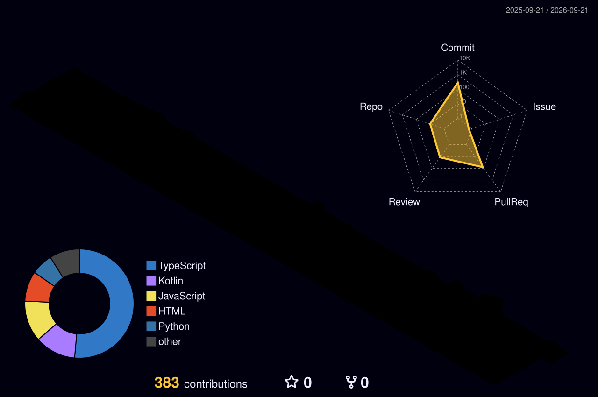

# 👋 Hi, I'm Chan

 

**사용자 경험과 유지보수성을 고려하는 개발자 박찬서입니다.**

React와 Next.js를 중심으로 웹 프론트엔드를 개발하고 있으며,
Flutter를 활용한 모바일 개발과 AI · Embedded 분야도 경험하고 있습니다.

 

  

## 🔥 Currently Working On

### 📈 AI STOCK

**AI 기반 개인 맞춤형 투자 의사결정 지원 서비스**

`React` `Next.js` `TypeScript` `Tailwind CSS` `Spring Boot` `MySQL` `Redis` `AWS`

**Role · Frontend Developer**

 

### 🚁 Dongyang EXPO 2026

**공사현장 위기상황 탐지 및 대응을 위한 드론 모니터링 시스템**

공사현장에서 발생할 수 있는 위험 상황을 탐지하는 드론과
드론의 상태 및 현장 상황을 실시간으로 모니터링하고 제어할 수 있는 웹 서비스를 개발하고 있습니다.

**Drone · Hazard Detection · Real-time Monitoring · Web Control**

 

### 📱 Mobile Development

UMC 11th Mobile 파트에 지원해 Flutter와 Dart를 활용한 모바일 애플리케이션 개발을 공부하고 있습니다.

`Flutter` `Dart` `Android Studio`

🔗 [UMC-Mobile-Study](https://github.com/programingA/UMC-Mobile-Study)

 

## 🛠 Tech Stack

### 💻 Languages

 

  

### 🌐 Frontend

  

### 📱 Mobile

  

### ⚙️ Backend & Database

  

### 🤖 AI & Embedded

  

### ☁️ Infra & Tools

  

## 🏆 Experience & Activities

|       Period      | Activity               | Description                                                                   |
| :---------------: | :--------------------- | :---------------------------------------------------------------------------- |
| 2025.01 ~ 2025.12 | **MIT Club President** | MIT 동아리 회장                                                                    |
| 2026.05.09 | **SOMKATHON** | PM으로 참가하여 '밈학당'이라는 프로젝트를 설계하여 발표 |
|      UMC 10th     | **UMC Web · Passro**   | Web 파트로 참여하여 타 대학 PM · Designer · Backend와 협업해 대학생 통학 동선 기반 배달 서비스 개발 및 대회 출품 |

 

## 🥇 Awards

### 🏅 2025 동양 EXPO — 장려상

**시각장애인을 위한 Smart Wearable**

`C` `Python` `YOLO` `LiDAR` `Ultrasonic Sensor` `Gyroscope` `Bluetooth`

프로젝트 전체 시스템을 단독으로 설계 및 개발했습니다.

**32팀 참가 → 최종 16팀 진출 → 장려상**

 

## 🚀 Projects

| Project                            | Description                     | Tech Stack                                           |                            Repository                           |
| :--------------------------------- | :------------------------------ | :--------------------------------------------------- | :-------------------------------------------------------------: |
| 🎬 **Cinema Memory**               | 개인의 추억을 영화처럼 기록하고 다시 감상하는 웹 서비스 | `Next.js` `TypeScript` `Spring Boot` `MySQL` `Redis` |     [🔗 View](https://github.com/programingA/Cinema-Memory)     |
| 🌌 **Memory Space**                | 기억과 장소를 연결하여 기록하는 웹 서비스         | `React` `Java` `SQL`                                 |  [🔗 View](https://github.com/programingA/Memory-Space-Project) |
| 🚗 **Autonomous Driving Mini Car** | Jetson과 Arduino 기반 자율주행 미니카     | `Python` `YOLOv8` `OpenCV` `Arduino`                 | [🔗 View](https://github.com/programingA/IoT_automatic_driving) |

 

## 📊 GitHub Activity

  

  

## 🌱 3D Contribution Graph

  

## 📫 Contact

  

### 💻 Keep Learning · Keep Building 🚀

